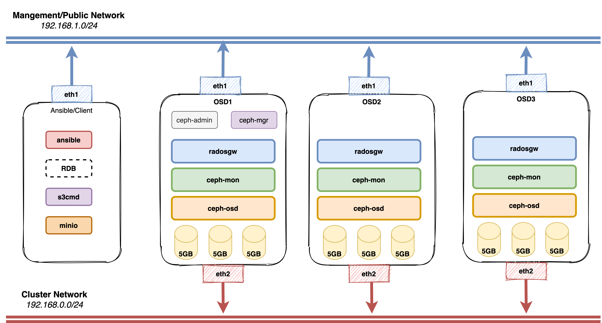

Ceph Home Lab
==============

# Introduction

People often complains that Ceph is hard to learn and operate. But from what I have seen, that is because we dont have a good lab environment to get familiar with Ceph.

This repo will guide you to setup a simple Ceph multi-node cluster on your laptop and cover most of the basic operations (configure, maintain...)

All contributions/suggestions are welcomed :D

~~Let your laptop burn :p~~

A quick glance on our lab architeture



Requirements
* Vagrant
* Virtual box/VMware

## Setup Virtualbox

Download here https://www.virtualbox.org/wiki/Downloads

## **Setup Vagrant**

Download here https://www.vagrantup.com/downloads.html

### Instal vagrant plugin

```bash
# Install hostmanager plugin for vagrant
vagrant plugin install vagrant-hostmanager
vagrant plugin list

# Add new ubuntu image
vagrant box add bento/ubuntu-16.04
```

## **Setup Ceph Cluster**

We need to create a lab directory to store our Ceph images/disks

We will create 3 Ceph VMs, each VM will have 3x 5GB disks to serve as OSD and another ansible VM to act as a controller/admin node

```bash
mkdir /opt/vagrant-ceph
touch /opt/vagrant-ceph/Vagrantfile
vim /opt/vagrant-ceph/Vagrantfile
```

Prepare a Vagrantfile like this. I already prepared a working vagrant config for you

```vagrantfile
nodes = [
  { :hostname => 'ansible', :ip => '192.168.0.40', :ip_pub => '192.168.1.40', :box => 'xenial64' },
  { :hostname => 'osd1',  :ip => '192.168.0.51', :ip_pub => '192.168.1.51', :box => 'xenial64', :ram => 1024, :osd => 'yes' },
  { :hostname => 'osd2',  :ip => '192.168.0.52', :ip_pub => '192.168.1.52', :box => 'xenial64' , :ram => 1024, :osd => 'yes' },
  { :hostname => 'osd3',  :ip => '192.168.0.53', :ip_pub => '192.168.1.53', :box => 'xenial64' , :ram => 1024, :osd => 'yes' }
]

Vagrant.configure("2") do |config|
  nodes.each do |node|
    config.vm.define node[:hostname] do |nodeconfig|
      nodeconfig.vm.box = "bento/ubuntu-16.04"
      nodeconfig.vm.hostname = node[:hostname]
      nodeconfig.vm.network :private_network, ip: node[:ip]

      memory = node[:ram] ? node[:ram] : 512;
      nodeconfig.vm.provider :virtualbox do |vb|
        vb.customize [
          "modifyvm", :id,
          "--memory", memory.to_s,
        ]
        if node[:osd] == "yes"
            #/dev/sdb
            vb.customize [ "createhd", "--filename", "disk_osd-sdb-#{node[:hostname]}", "--size", "5000" ]
            vb.customize [ "storageattach", :id, "--storagectl", "SATA Controller", "--port", 3, "--device", 0, "--type", "hdd", "--medium", "disk_osd-sdb-#{node[:hostname]}.vdi" ]

            #/dev/sdc
            vb.customize [ "createhd", "--filename", "disk_osd-sdc-#{node[:hostname]}", "--size", "5000" ]
            vb.customize [ "storageattach", :id, "--storagectl", "SATA Controller", "--port", 4, "--device", 0, "--type", "hdd", "--medium", "disk_osd-sdc-#{node[:hostname]}.vdi" ]

            #/dev/sdd
            vb.customize [ "createhd", "--filename", "disk_osd-sdd-#{node[:hostname]}", "--size", "5000" ]
            vb.customize [ "storageattach", :id, "--storagectl", "SATA Controller", "--port", 5, "--device", 0, "--type", "hdd", "--medium", "disk_osd-sdd-#{node[:hostname]}.vdi" ]
        end
      end
    end
    config.hostmanager.enabled = true
    config.hostmanager.manage_guest = true
  end
end
```

Boot up the cluster

```bash
# Start the VMs
vagrant up

# Check new VMs statuses
vagrant status
```

Login to the ansible VM via vagrant ssh

```bash
#User/Pass: vagrant/vagrant
vagrant ssh ansible
```

Some other useful commands in case you want to stop the lab and continue later

```bash
# Shutdown the VMs (still keeps the data)
vagrant halt

# Start the VMs again
vagrant up
```

Setup Ansible Controller node

```bash
vagrant ssh ansible

sudo apt-add-repository ppa:ansible/ansible-2.8
sudo apt-get update && sudo apt-get install ansible -y

# We need to copy the Ansible VM public key to other Ceph nodes
# Generate sshkey
ssh-keygen
ssh-copy-id osd1
ssh-copy-id osd2
ssh-copy-id osd3
```

# Create an inventory host file for Ansible

```text
sudo vim /etc/ansible/hosts

[mons]
osd1
osd2
osd3

[mgrs]
osd1

[rgws]
osd1
osd2
osd3

[osds]
osd1
osd2
osd3

[ceph:children]
mons
osds
mgrs
```

Check ansible ad-hoc commands

```bash
ansible mons -m ping
ansible osds -a 'uname -r'
```

## Get Ceph Module for Ansible

Read this to know which version we should use: https://docs.ceph.com/ceph-ansible/master/index.html#releases

In in this entrytask, we use version stable-3.2 for Mimic

You can also try on newer versions like Nautilus (my favorite) and Octopus

```bash
git clone https://github.com/ceph/ceph-ansible.git
cd ceph-ansible
git checkout stable-3.2
sudo cp -a ./* /etc/ansible/

sudo apt-get update -y
sudo apt-get install python-pip -y
sudo pip install --upgrade pip
sudo pip install notario netaddr 
```

## Setup ceph group_vars

```bash
sudo mkdir /etc/ansible/group_vars
```

Prepare the Ceph group vars file

*/etc/ansible/group_vars/ceph*

```bash
ceph_origin: 'repository'
ceph_repository: 'community'
ceph_mirror: http://download.ceph.com
ceph_stable: true # use ceph stable branch
ceph_stable_key: https://download.ceph.com/keys/release.asc
ceph_stable_release: mimic # ceph stable release
ceph_stable_repo: "{{ ceph_mirror }}/debian-{{ ceph_stable_release }}"
monitor_interface: eth1 #Check ifconfig on created VMs to update this value
monitor_address_block: 192.168.1.0/24
public_network: 192.168.1.0/24
cluster_network: 192.168.0.0/24
radosgw_address_block: 192.168.1.0/24
```

Change the group var configuration

*/etc/ansible/group_vars/osds*

```bash
osd_scenario: lvm
lvm_volumes:
- data: /dev/sdb
- data: /dev/sdc
- data: /dev/sdd
```

Create a fetch folder and change the owner to the vagrant user:

```bash
sudo mkdir /etc/ansible/fetch
sudo chown vagrant /etc/ansible/fetch
```

## Deploy new Ceph cluster

Run the Ceph cluster deployment playbook:

```bash
cd /etc/ansible
sudo mv site.yml.sample site.yml
ansible-playbook -K site.yml
```

Check if the new ceph cluster is running properly.

```bash
vagrant ssh osd1

# Check if the cluster is healthy
ceph -s
ceph health detail
ceph df

# Check monitors status
ceph quorum_status
ceph mon stat

# Check OSDs status
ceph osd stat
ceph osd tree

# Check MDS status
ceph mds stat
```

Congrats, you have finished setup a new Ceph cluster your self. But it is just the beginning ;). There are much harder stuff waiting for you!

# Day 2 - Daily Operations

The purpose of this part is for getting familiar with daily operations though these tasks

## High-Level Operations

* https://docs.ceph.com/docs/master/rados/operations/operating/
* https://docs.ceph.com/docs/master/rados/operations/health-checks/
* https://docs.ceph.com/docs/master/rados/operations/monitoring-osd-pg/
* https://docs.ceph.com/docs/master/rados/operations/monitoring/
* https://docs.ceph.com/docs/master/rados/operations/user-management/

## Low-Level Operations

* https://docs.ceph.com/docs/master/rados/operations/add-or-rm-osds/
* https://docs.ceph.com/docs/master/rados/operations/add-or-rm-mons/
* https://docs.ceph.com/docs/master/rados/operations/devices/
* https://docs.ceph.com/docs/master/rados/operations/control/

## Data Placement

* https://docs.ceph.com/docs/master/rados/operations/data-placement/
* https://docs.ceph.com/docs/master/rados/operations/pools/
* https://docs.ceph.com/docs/master/rados/operations/erasure-code/
* https://docs.ceph.com/docs/master/rados/operations/placement-groups/
* https://docs.ceph.com/docs/master/rados/operations/balancer/
* https://docs.ceph.com/docs/master/rados/operations/upmap/
* https://docs.ceph.com/docs/master/rados/operations/crush-map/
* https://docs.ceph.com/docs/master/rados/operations/crush-map-edits/

## Troubleshooting

* https://docs.ceph.com/docs/master/rados/troubleshooting/troubleshooting-mon/
* https://docs.ceph.com/docs/master/rados/troubleshooting/troubleshooting-osd/
* https://docs.ceph.com/docs/master/rados/troubleshooting/troubleshooting-pg/
* https://docs.ceph.com/docs/master/rados/troubleshooting/log-and-debug/
* https://docs.ceph.com/docs/master/rados/troubleshooting/cpu-profiling/
* https://docs.ceph.com/docs/master/rados/troubleshooting/memory-profiling/

# Cleaning up

Clean up the cluster after you have finished everything

```bash
vagrant destroy --force
```
